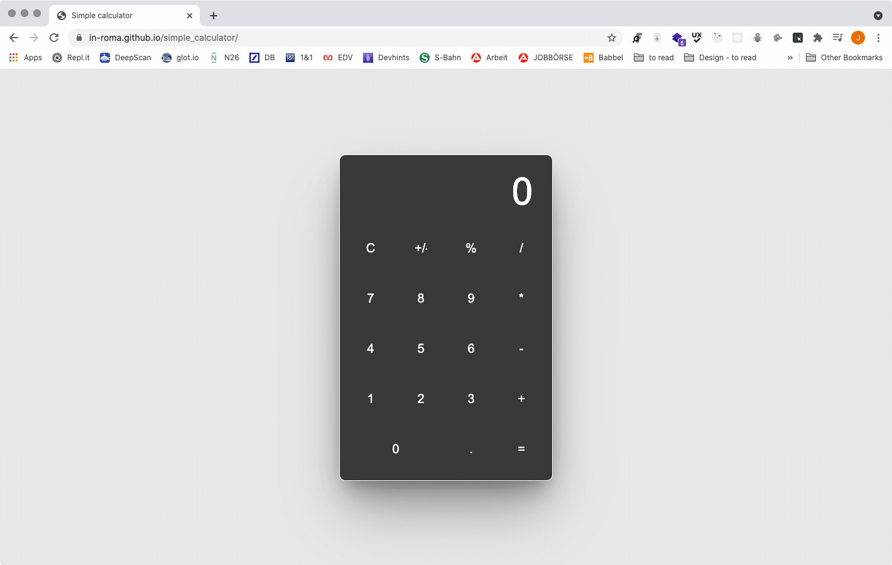

## DCi exercise / Calculator / April 2020
Creating a calculator with Vanilla Javascript. [Link to project](https://in-roma.github.io/simple_calculator/)

## Tech Stack

**Client:** Vanilla Javascript
  
